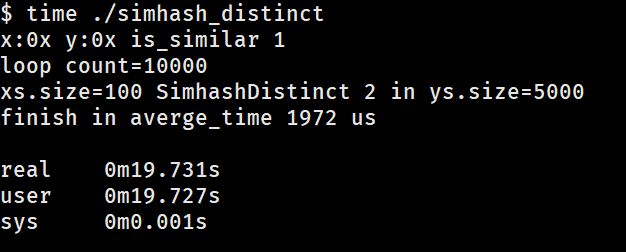
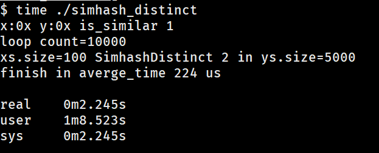

背景
==================

最近在学习并行计算，一开始打算用Rust,但是考虑到Rust的生态支持太差，比如没有gRPC绑定，后续想提供在线服务比较麻烦。
于是选择了C++，C++做并行计算的框架也有很多。这里选择了TBB，没有为什么。随机调查了下之后选的。

问题
===

这里做的计算是根据simhash的海明距离去重，由于C++不太熟练，实现较为粗糙，不太确定是否有内存泄漏。

串行结果：

并行结果：

